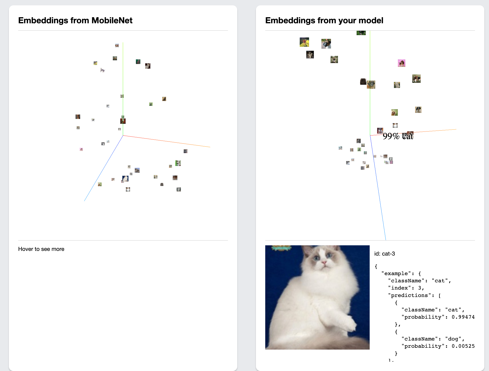
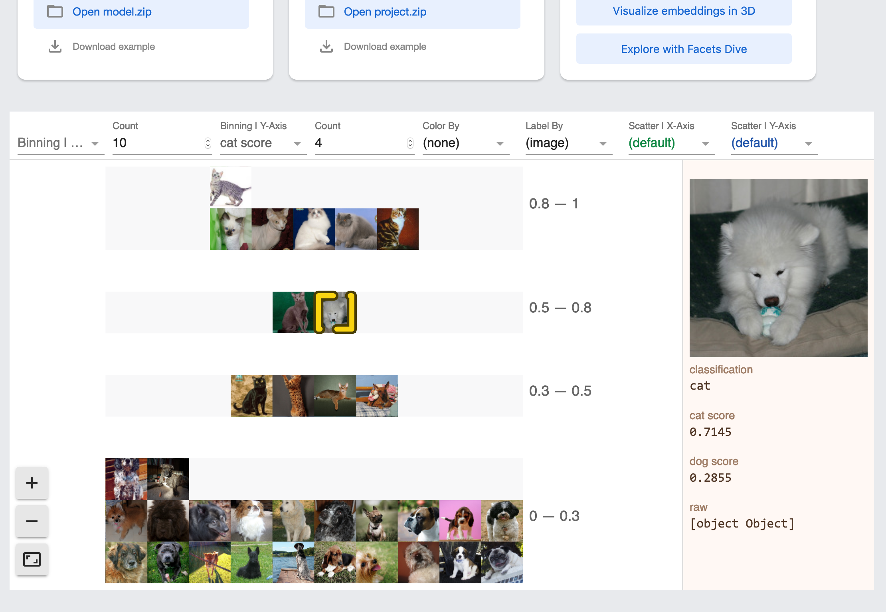

# questionable-machine
just early hacking so far

# notes
"we derive CAVs by training a linear classifier between a concept’s examples and random counter examples and then taking the vector orthogonal to the decision boundary"
- better: we provide random examples

## screenshots
### flow

### browsing

### embedding spaces

### stretching the space

### 3d sprites are ooooh, but confusing

### facets is better for exploring

## datasets
### oxford pets
https://www.robots.ox.ac.uk/~vgg/data/pets/
https://www.kaggle.com/tanlikesmath/the-oxfordiiit-pet-dataset