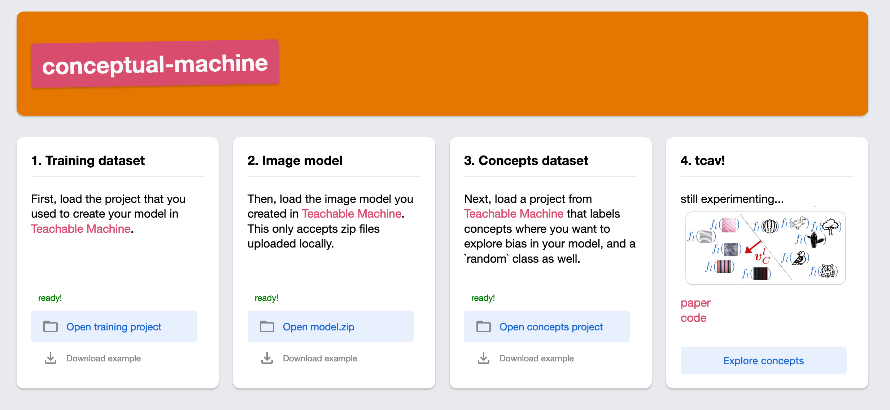
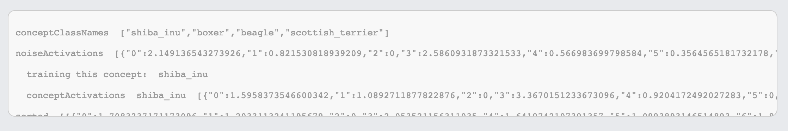
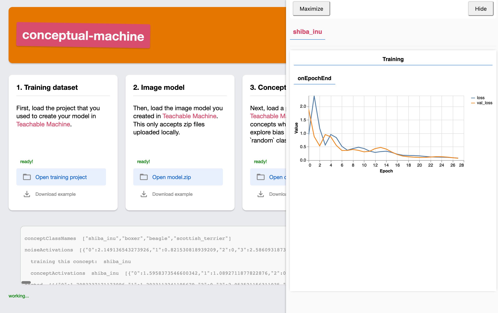
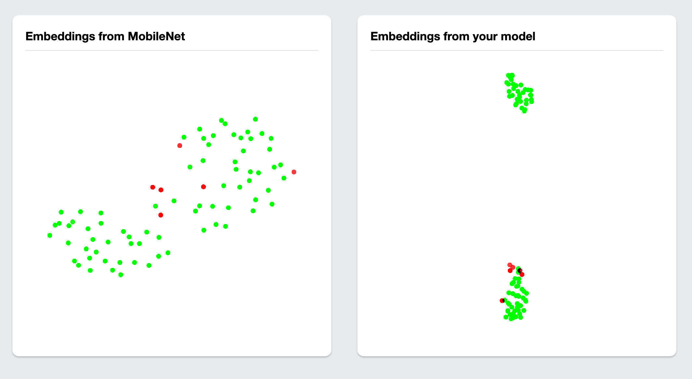
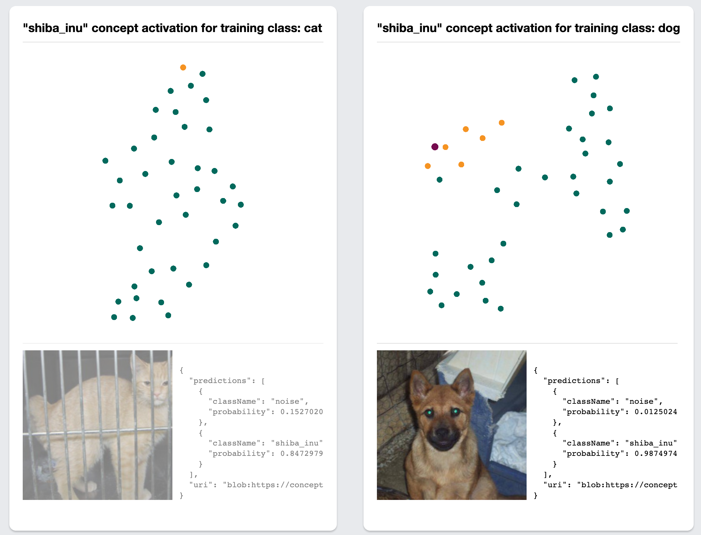
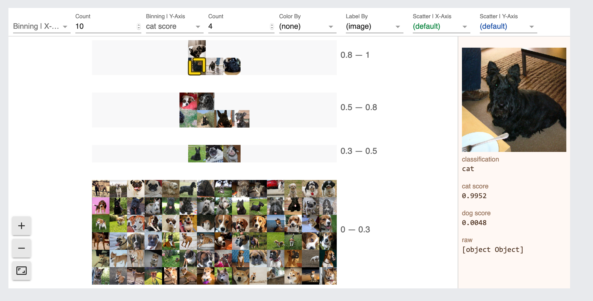
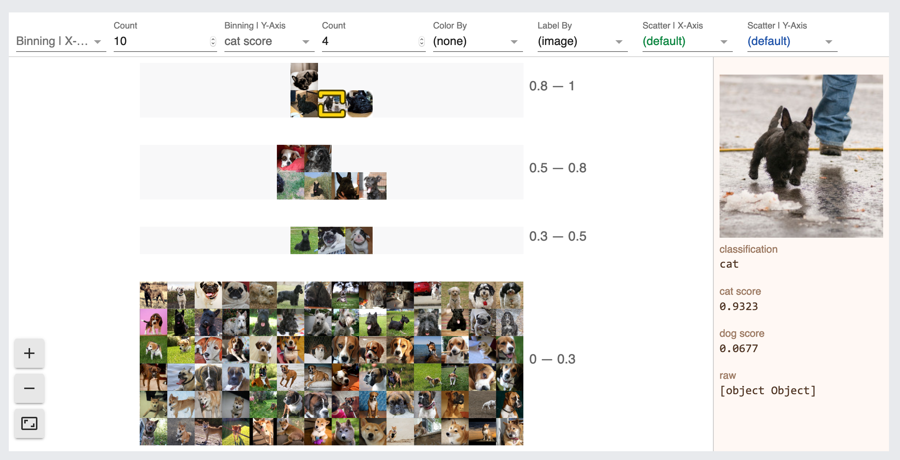
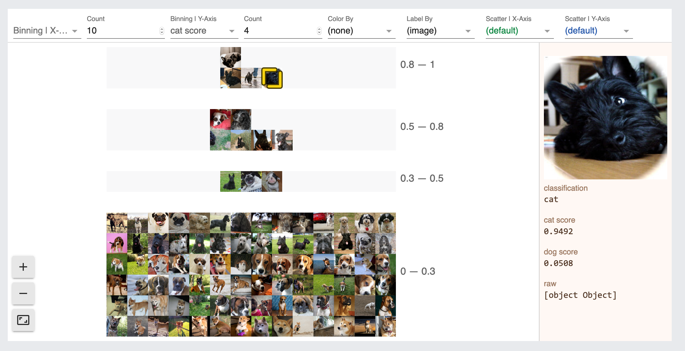

# conceptual-machine
just early hacking so far

"we derive CAVs by training a linear classifier between a concept’s examples and random counter examples and then taking the vector orthogonal to the decision boundary"

"a CAV encodes the direction of a concept in the vectorspace of a bottleneck"

"compute cosine similarity between a set of picturesof interest to the CAV to sort the pictures"

## screenshots
### flow


### debugging log for nerds


### watch the training (thanks tfvis!)


### these animals are cute but not very shiba...
(activations from concept classifier projected with umap, colored by concept classification)


### these ones are moar shiba



### huh, the scottish terrier concept seems weird...


### how does the model do on pictures of terriers?
let's look over in [warping-machine](https://github.com/kevinrobinson/warping-machine):




### woah guess it is pretty biased
...


## datasets
### oxford pets
https://www.robots.ox.ac.uk/~vgg/data/pets/
https://www.kaggle.com/tanlikesmath/the-oxfordiiit-pet-dataset

## random scripts
### glasses/not, from celeba
```
# find offset (add 1 to it)
cat annotations/list_attr_celeba.txt | tail -n +2 | head -n1 | cut -d' ' -f16

# 17: glasses
rm -rf sampled/eyeglasses-no
rm -rf sampled/eyeglasses-yes
rm -rf sampled/random-tail

mkdir -p sampled/eyeglasses-no
mkdir -p sampled/eyeglasses-yes
mkdir -p sampled/random-tail

# sample 40 each (from head)
cat annotations/list_attr_celeba.txt | tail -n +3 |  awk '{ print $1, $17 }' | grep ' 1' | cut -d' ' -f1 | sort -R | head -n40 | xargs -I {} cp img_align_celeba/{} sampled/eyeglasses-yes/{}
cat annotations/list_attr_celeba.txt | tail -n +3 |  awk '{ print $1, $17 }' | grep ' -1' | cut -d' ' -f1 | sort -R | head -n40 | xargs -I {} cp img_align_celeba/{} sampled/eyeglasses-no/{}

# random sample (from tail)
cat annotations/list_attr_celeba.txt | tail -n +3 |  awk '{ print $1 }' | sort -R | tail -r | head -n40 | xargs -I {} cp img_align_celeba/{} sampled/random-tail/{}
```