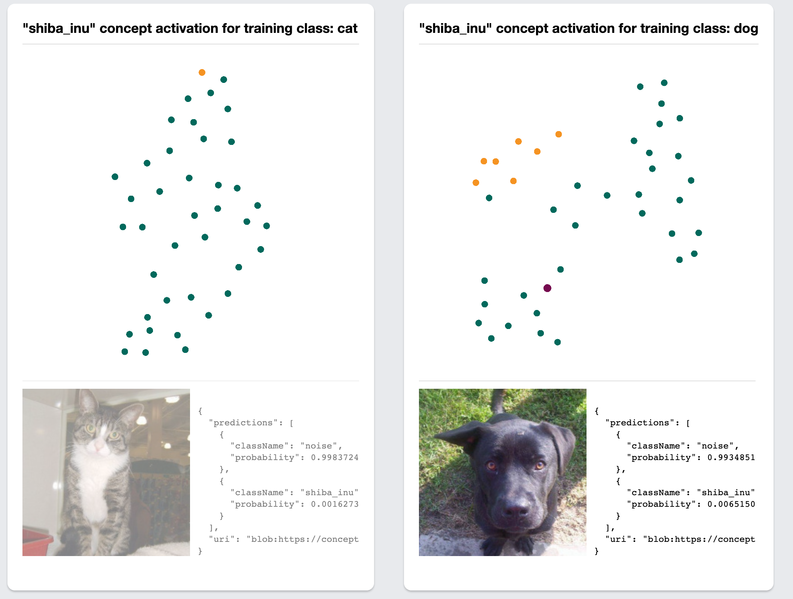
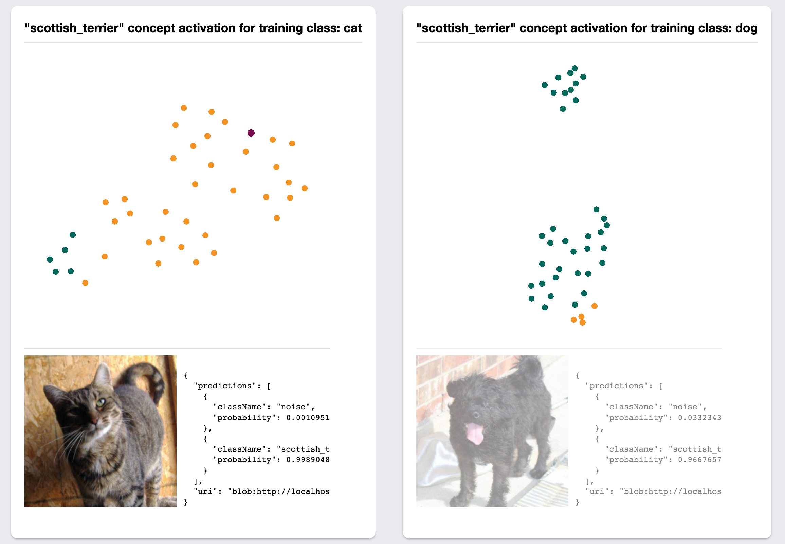

# conceptual-machine
just early hacking so far

"we derive CAVs by training a linear classifier between a concept’s examples and random counter examples and then taking the vector orthogonal to the decision boundary"

## screenshots
### flow

### debugging log for nerds

### these animals are cute but not very shiba...
(concept activations projected with umap, colored by concept classification)

### these ones are moar shiba

### huh, the scottish terrier concept seems weird...

### how does the model do on pictures of terriers?
let's look over in [warping-machine](https://github.com/kevinrobinson/warping-machine):

### woah guess it is pretty biased
...

## datasets
### oxford pets
https://www.robots.ox.ac.uk/~vgg/data/pets/
https://www.kaggle.com/tanlikesmath/the-oxfordiiit-pet-dataset
